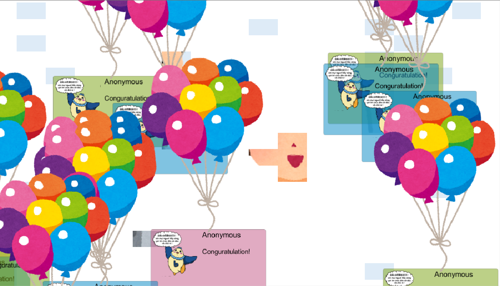
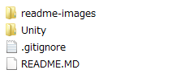
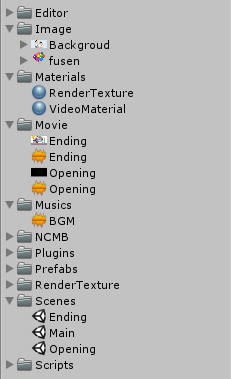
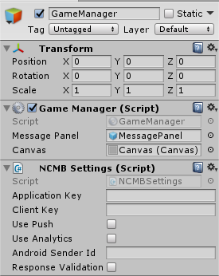
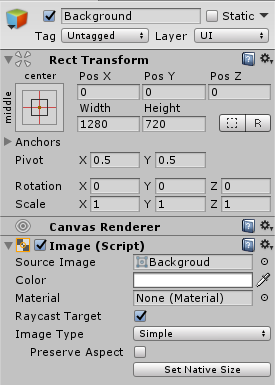
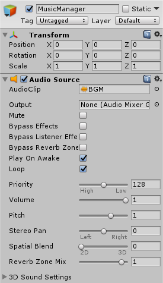
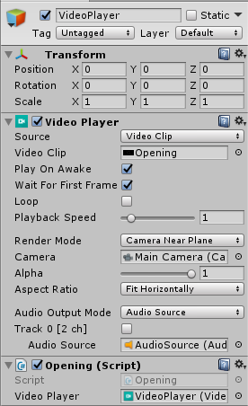

# 『全員参加！メッセージ送信ゲーム』Unityアプリ

<br><br>

## 概要
* 同僚の披露宴の余興で実施した『全員参加！メッセージ送信ゲーム』ゲーム本体のUnityアプリです
* ゲームを動作させるためには本Unityアプリの準備の他、「クライアント側【Webアプリ】」の環境構築が必要です
* 「クライアント側【Webアプリ】」については以下を参照してください
  * _ページ準備中_

## 『全員参加！メッセージ送信ゲーム』とは？

<br><br>

* 『全員参加！メッセージ送信ゲーム』は100人超の披露宴参加者全員参加で遊べるお祝いゲームです
* 各自所有しているスマートフォンから指定URLにアクセスすることで誰でも参加できます
* URLにアクセスしたら「名前」と「自撮り画像」を登録します
* ゲームが開始されたら新郎新婦へのお祝いのメッセージを送ります
* お祝いメッセージが登録されると、ゲーム本体に写真付きメッセージが表示されていきます
* お祝いメッセージがいっぱいになると…何かが起こる！？

## 『全員参加！メッセージ送信ゲーム』Unityアプリ事前準備
* ニフクラ mobile backend (以下 mBaaS) の会員登録（無料）
  * http://mb.cloud.nifty.com/

## 動作までの手順
### 1. プロジェクトのダウンロード
* 下記リンクをクリックしてローカルに zip ファイルをダウンロードします
  * https://github.com/syyama/WeddingProjectUnityApp/archive/master.zip
* zip ファイルは解凍しておきます

### 2. mBaaS にアプリを作成
* mBaaS にログインします
  * https://console.mb.cloud.nifty.com/

* アプリの新規作成をします
  * 既に他のアプリを作成済みの場合は、左上の「+新しいアプリ」をクリックします

<br>

* APIキー が発行されます

<br><br>

* 後ほど使用しますので、ここは「OK」をクリックして閉じます
* 閉じるとダッシュボード（管理画面）が表示されます

### 3. プロジェクトファイルの編集
* 先ほどダウンロードし、解凍しておいたフォルダを開きます

<br><br>

* `Unity` フォルダをUnityでプロジェクトとして開きます

<br><br>

* 主なフォルダ構成としては下記の通りです
  * `Image`: プロジェクトで利用する画像を保存します
  * `Movie`: ゲームの前後の動画を保存します
  * `Music`: ゲーム中のBGMを保存します
  * `Scene`: 当プロジェクトのシーンは3つで構成されています
    * `Opening`: ゲームが開始するタイミングで再生される動画のシーンです
    * `Main`: ゲーム本編です
    * `Ending`: ゲームが終了したタイミングで再生される動画のシーンです
  * `Scripts`: 当プロジェクトで利用したスクリプトファイルを保存しています
* 当プロジェクトには `Movie` と `Music` のファイルは含まれていませんので、必要に応じて追加してください

* `Main` シーンの `GameManager` オブジェクトの `NCMB Settings` コンポーネントに mBaaS でアプリを作成した際に生成された APIキー を設定します

<br><br>

* APIキー は、mBaaS ダッシュボードの右上「アプリ設定」から確認できます

<br><br>

* 次に、`GameManager.cs`の18行目のAPIのURLの `**********` の箇所を編集します

* `YOUR_NCMB_APPLICATION_ID` の部分を mBaaSのアプリIDに書き換えます
* アプリIDは mBaaS ダッシュボードのURLに記載しています
* 例では `**********` としている箇所がアプリIDです

```txt
例）
https://console.mb.cloud.nifty.com/#/applications/**********/
```
### 4. ゲームで使用する背景の設定する

* `Main` シーンの `Backgroud` オブジェクトの `Image` コンポーネントの `Source Image` を設定することで、ゲームで使用する背景を設定することができます
* なお画像は `Sprite` として用意する必要があります

<br><br>

### 5. ゲームのBGMの設定をする

* `Main` シーンの `MusicManager` オブジェクトの `Audio Source` コンポーネントの `Audio Clip` を設定することで、ゲームで使用するBGMを設定することができます
* なお、ループ再生を行うには `Loop` にチェックを入れておきます

<br><br>

### 6. オープニング・エンディング動画の設定をする

* `Opening` または `Ending` シーンの `VideoPlayer` オブジェクトの `VideoPlayer` コンポーネントの `Video Clip` を設定することで、オープニング・エンディングそれぞれで再生する動画を設定できます
* 今回は動画再生と同時にBGMを流すので、`Audio Source` の項目に動画再生時に流す音声を設定しておきます

<br><br>


## 遊び方 ～参加方法～
* URLにアクセスして、名前の入力と写真ファイルの選択をします
* 「Regist」ボタンを押します

<br><br>

* ゲームが開始したら、お祝いメッセージを送ります
* 「おめでとう」ボタン（ベトナム語あり）または、自由記述でメッセージを送ることができます

<br><br>

* データストアにメッセージが登録され、Unity側でメッセージを取得し表示させます

<br><br>


## 解説

### メッセージの取得

### 自撮り画像の取得

### その他Tips

### Webアプリとの連携イメージ
* Webアプリを通して各自所有しているスマートフォンから「名前」と「自撮り画像」を mBaaS に登録します
* お祝いメッセージは同時アクセスが可能なようにスクリプトを通してデータストアに保存します
* Unity側でデータストアの情報をポーリングでデータ件数を取得し、追加があればゲームを進める仕組みです
* 詳細は ゲーム本体【Webアプリ】の解説ページ を参照ください
  *  _ページ準備中_

## 参考
* 取り急ぎ作ったゲームなので、一部ソースが酷い箇所があります。何卒ご容赦ください。